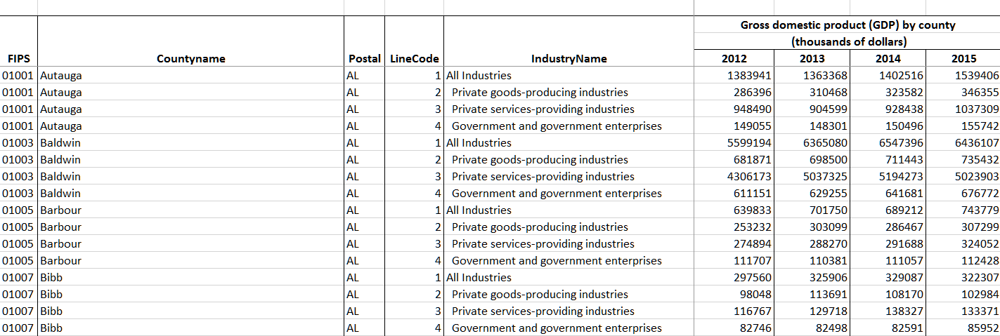

```{r setup, include = FALSE}
knitr::opts_chunk$set(
  collapse = TRUE,
  comment = "#>"
)
```

The data for this exercise was found here: https://www.bea.gov/news/2018/prototype-gross-domestic-product-county-2012-2015

There are a couple of Excel spreadsheets to choose from. We chose the "Data Table for GDP by County".
The data was downloaded 16 Apr 2019 from: https://www.bea.gov/system/files/2018-12/GCP_Release_1.xlsx.

Here's a screenshot of the file open in Excel.

```{r}

```

                          
```{r}
library(untidydata2)
library(readxl)
datfile <- system.file("messydata", "gdp_by_county.xlsx", package="untidydata2")
dat <- read_excel(datfile, "Current Dollar GDP")
```

The Excel file has mutliple header rows. Based on a little experimentation, we drop the first two rows and manually assign column names.

```{r}
dat <- dat[-c(1:2),]
names(dat) <- c("fips","county","state","item","sector","gdp2012","gdp2013","gdp2014","gdp2015")
head(dat)
```

I usually check the `tail` of a dataset, and in this case there are several blank rows.  Looking in the Excel file, we learn that these are a couple of footnotes.  We need to omit those rows.

```{r}
# tail(dat)
library(dplyr)
dat <- filter(dat, !is.na(state))
```

Gather the GDP columns into a single column.
```{r}
library(tidyr)
dat <- gather(dat, key, value, gdp2012:gdp2015)
dat <- mutate(dat, value=as.numeric(value)) # note, "(D)"
dat <- mutate(dat, year=readr::parse_number(key)) # extract year
dat <- select(dat, -key, -item)
dat <- mutate(dat, year=as.character(year)) # so 'spread' will treat it as ID
dat <- spread(dat, sector, value) # turn sector column into multiple columns
dat <- rename(dat, all="All Industries", govt="Government and government enterprises",
              goods="Private goods-producing industries", service="Private services-providing industries")
```

```{r, fig.height=6, fig.width=6}
library(maps)
library(dplyr)
library(plotrix) # for color.scale

data(county.fips)
#   fips        polyname
# 1 1001 alabama,autauga
# 2 1003 alabama,baldwin

# now add the gdp data (from the right) to make sure color code is ordered 
# in the right way
#dat <- mutate(dat, fips=as.numeric(fips))
#fipsdat <- left_join(county.fips, dat, by='fips')
#fipsdat$col = plotrix::color.scale(log(fipsdat$govt), c(0,1,1),c(1,1,0),0)
#map("county", fill=TRUE, col=fipsdat$col)

# get the names of the polygons used by map
nms <- map("county", plot=FALSE, namesonly=TRUE)
polys <- data.frame(polyname=nms)
polys <- mutate(polys, polyname = as.character(polyname))
# add the fips code
polys <- left_join(polys, county.fips )
# add the 2015 gdp data by fips
dat = mutate(dat, fips=as.numeric(fips))
polys <- left_join(polys, filter(dat, year==2015), by="fips")
# add population
data(unemp)
polys <- left_join(polys, unemp, by="fips")
# gdp per pop
polys <- mutate(polys, gdpperpop=all/pop)
# calcualte color for each polygon
polys <- mutate(polys,
                col = plotrix::color.scale(gdpperpop, c(0,1,1),c(1,1,0),0))
map("county", fill=TRUE, col=polys$col)
```

Unfortunately, there's no scale shown.
The colors are horrible.
Nothing interesting in this view.

NEEDS WORK.


