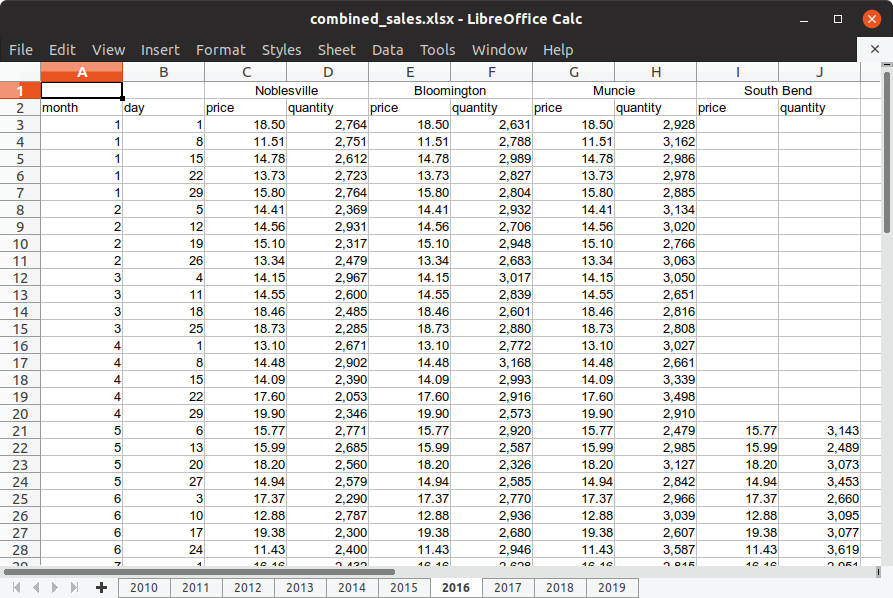

```{r setup, include=FALSE}
knitr::opts_chunk$set(echo = TRUE)
```

## Working with untidy spreadsheet data

I created an untidy spreadsheet of simulated sales data for a company with multiple locations in Indiana. The document presents several challenges we often encounter with real spreadsheets, including:

* Separate sheets (tabs) for each year of the data
* Multiple header rows, including one with "merged cells"
* Repeated headers within the same sheet
* Number of columns varies by sheet

The document contains 10 sheets (tabs), so coding them one-by-one isn't very appealing. We'll want to automate processing the sheets.

### Manually process a representative sheet

Before we create an automated solution, let's start by manually processing a representative sheet so we can figure out what we need to automate.

Opening the document in your favorite spreadsheet software, we see that the first few sheets contain data for just one location, Noblesville. Sheet 7 (for 2016) looks like a good one to work with because it has data for multiple locations.

Notice that the location names are in cells that have been merged and centered, and there are price and quantity columns for each of the locations. Also notice that data for the last location, South Bend, is missing for the first several rows.

```{r}

```

Let's start by loading the `tidyverse` and `readxl` packages and setting `file_name` to the path to the spreadsheet. Since the spreadsheet is part of the `untidydata2` package, we use `system.file` to return a path to the spreadsheet.

```{r}
library(tidyverse)
library(readxl)

file_name <- system.file("messydata", "combined_sales.xlsx", package="untidydata2")

```


First, let's get a list of locations contained in sheet for 2016 using `readxl::read_excel`. We can read just the first row by setting `n_max = 0` and then passing the result to `names`.

```{r message=FALSE}
read_excel(file_name, sheet = "2016", n_max = 0) %>%
  names()
```

The merged cells are coming back with names of "...2", "...4", etc. We can remove them from the list with `stringr::str_subset` and a regular expressing that matches "..." at the beginning of a string.

```{r message=FALSE}
locations <- read_excel(file_name, sheet = "2016", n_max = 0) %>%
  names() %>%
  str_subset("^\\.{3}", negate = TRUE)

locations
```

Now we have a character vector of locations. Let's read data from the 2016 sheet, skipping the first row this time.

```{r message=FALSE}
read_excel(file_name, sheet = "2016", skip = 1)
```
We're making progress but we need to do something to associate the `price...` and `quantity...` variables with their correct locations. Later we will want to have a separate variable for location, but for now let's rename our `price` and `quantity` variables to `price_Noblesville`, `quantity_Noblesville`, `price_Bloomington`, `quantity_Bloomington`, etc.
 
Notice that `price...3` and `quantity...4` correspond to the first location, `price...5` and `quantity...6` correspond to the second location, etc. Let's write a function to give us the corresponding location index for each value 3, 4, 5, 6, etc.

```{r message=FALSE}
loc_index <- function(n) {
  floor((n-1)/2)
}
```

Now let's verify that this works.

```{r}
loc_index(3:10)
```

Yes it does.

Now we can write a function to calculate a new name for each column we want to rename.

```{r}
new_name <- function(columns) {
  num <- as.integer(str_extract(columns, "\\d+"))
  location <- locations[loc_index(num)]
  str_replace(columns, paste0("...", num), paste0("_", location))
}
```

And let's verify that this works.

```{r}
new_name(c("price...3", "quantity...4", "price...5", "quantity...6"))
```

Okay. Now we're ready to read the spreadsheet and rename the columns.

```{r message=FALSE}
data_2016 <- read_excel(file_name, sheet = "2016", skip = 1) %>%
  rename_at(vars(contains("...")), new_name)

data_2016
```

Finally, let's extract location, price, and quanity variables. This is probably the trickiest part of tidying this data because it involves gathering multiple variables and then spreading them again. We also add the year and order the variables.

```{r}
data_2016 <- data_2016 %>%
  gather(-month, -day, key = "label", value = "value") %>%
  separate(label, into = c("type", "location"), sep = "_") %>%
  spread(key = "type", value = "value") %>%
  mutate(year = 2016) %>%
  select(year, month, day, location, price, quantity)
data_2016
```


This looks good, but it's just one sheet. Now let's write some code to process the whole spreadsheet document.

We'll need a vector of sheet names for the spreadsheet document.

```{r}
sheets <- excel_sheets(file_name)
sheets
```

And here is a function that combines everything we've done above to read any specified sheet from the document. It also handles the simpler special case when a sheet contains only a single location, and it removes the rows with NA values like the ones we saw for South Bend above.

```{r message=FALSE}
read_sheet <- function(file_name, sheet) {
  locations <- read_excel(file_name, sheet = sheet, n_max = 0) %>%
    names() %>%
    str_subset("^\\.{3}", negate = TRUE)

  df <- read_excel(file_name, sheet = sheet, skip = 1)
  
  if (length(locations) == 1) {
    df <- df %>%
      mutate(location = locations[1])
  } else {
    loc_index <- function(n) {
      floor((n-1)/2)
    }
    
    new_name <- function(columns) {
      num <- as.integer(str_extract(columns, "\\d+"))
      location <- locations[loc_index(num)]
      str_replace(columns, paste0("...", num), paste0("_", location))
    }
    
    df <- df %>%
      rename_at(vars(contains("...")), new_name) %>%
      gather(-month, -day, key = "label", value = "value") %>%
      separate(label, into = c("type", "location"), sep = "_") %>%
      spread(key = "type", value = "value")
  }
  
  df <- df %>%
    filter(!is.na(price) | !is.na(quantity)) %>%
    mutate(year = as.integer(sheet)) %>%
    select(year, month, day, location, price, quantity)

  df
}

read_sheet(file_name, "2016")
```

Now we use `purrr::map_dfr` to read a data frame for each sheet and combine them into a single data frame.

```{r, message=FALSE}
combined_df <- map_dfr(sheets, ~ read_sheet(file_name, .x))
head(combined_df)
tail(combined_df)
```

It was a lot of work, we now have a tidy data frame containing all of the data from the spreadsheet.
